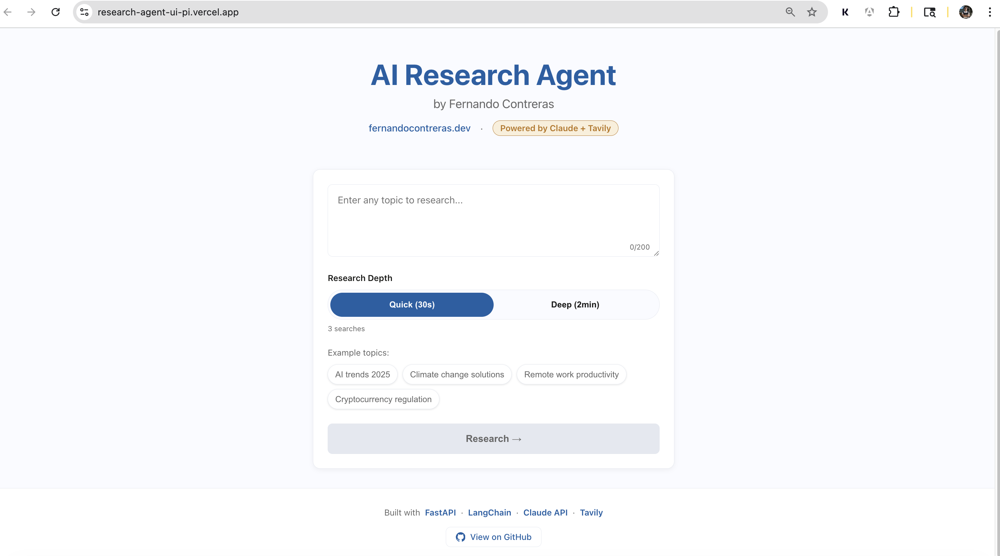

# AI Research Agent — Backend API

Autonomous AI agent that researches any topic and generates structured reports with sources.

## **[Live Demo](https://research-agent-ui-pi.vercel.app)**




## How It Works

1. **User submits a research topic** - User provides any topic through the frontend interface
2. **LangChain agent uses Tavily to search the web** - Agent performs autonomous web searches using Tavily API
3. **Claude reasons over search results** - Anthropic Claude Haiku analyzes and synthesizes the gathered information
4. **Agent decides if more searches are needed** - Intelligent decision-making for comprehensive research
5. **Claude synthesizes findings into a structured report** - Final report generation with proper structure and citations

## What Makes It A Research Agent 

This is true agentic AI — not just a prompt + response. The agent:

- **Uses tools autonomously** (Tavily search) to gather information
- **Decides how many searches to run** based on research depth (quick=3, deep=7)
- **Reasons about what information is missing** and performs additional searches if needed
- **Produces a complete deliverable independently** without user intervention
- **Synthesizes findings** into a structured, professional report with sources

## Tech Stack

**Backend:**
- **Python** - Core programming language
- **FastAPI** - High-performance web framework
- **LangChain** - Agent orchestration framework
- **Anthropic Claude Haiku** (claude-haiku-4-5-20251001) - Reasoning and synthesis
- **Tavily Search API** - Real-time web search capabilities

**Deployment:**
- **Railway** - Cloud hosting platform

**Frontend:** (separate repo - [link below](https://github.com/fernandojosecc/research-agent-ui))
- **Next.js** - Modern React framework

## API Endpoints

### GET /health
```json
{"status": "ok"}
```

### POST /research
**Request:**
```json
{
  "topic": "string",
  "depth": "quick|deep"
}
```

**Response:**
```json
{
  "title": "Research Report: [topic]",
  "summary": "Executive summary",
  "key_findings": ["finding 1", "finding 2"],
  "sections": [
    {
      "heading": "Section Title",
      "content": "Detailed content"
    }
  ],
  "sources": [
    {
      "title": "Source Title",
      "url": "https://example.com"
    }
  ],
  "generated_at": "2026-04-13T...",
  "topic": "original topic"
}
```

## Report Structure (JSON Schema)

```json
{
  "title": "Research Report: [topic]",
  "summary": "2-3 sentence executive summary",
  "key_findings": ["finding 1", "finding 2", "finding 3"],
  "sections": [
    {
      "heading": "section title",
      "content": "detailed paragraph"
    }
  ],
  "sources": [
    {
      "title": "source title",
      "url": "source url"
    }
  ],
  "generated_at": "timestamp",
  "topic": "original topic"
}
```

## Environment Variables

| Variable | Source | Required |
|----------|--------|----------|
| `ANTHROPIC_API_KEY` | [Anthropic Console](https://console.anthropic.com) | ✅ Required |
| `TAVILY_API_KEY` | [tavily.com](https://tavily.com) | ✅ Required |

## How to Run Locally

```bash
# Clone the repository
git clone https://github.com/fernandojosecc/research-agent-api.git
cd research-agent-api

# Create virtual environment
python -m venv venv
source venv/bin/activate  # On Windows: venv\Scripts\activate

# Install dependencies
pip install -r requirements.txt

# Create environment file
cp .env.example .env
# Edit .env with your API keys

# Start the server
uvicorn main:app --reload
```

## About

**Name:** Fernando Contreras  
**Portfolio:** [fernandocontreras.dev](https://fernandocontreras.dev)  
**GitHub:** [https://github.com/fernandojosecc](https://github.com/fernandojosecc)

**Project 3 of my AI engineering portfolio.**

1. **Project 1:** Bilingual chatbot with translation capabilities
2. **Project 2:** RAG document assistant with vector search
3. **Project 3:** Autonomous research agent with web search and synthesis

## Links

- **Backend API:** [https://research-agent-api-production.up.railway.app](https://research-agent-api-production.up.railway.app)
- **Backend GitHub:** [https://github.com/fernandojosecc/research-agent-api](https://github.com/fernandojosecc/research-agent-api)
- **Frontend GitHub:** [https://github.com/fernandojosecc/research-agent-ui](https://github.com/fernandojosecc/research-agent-ui)
